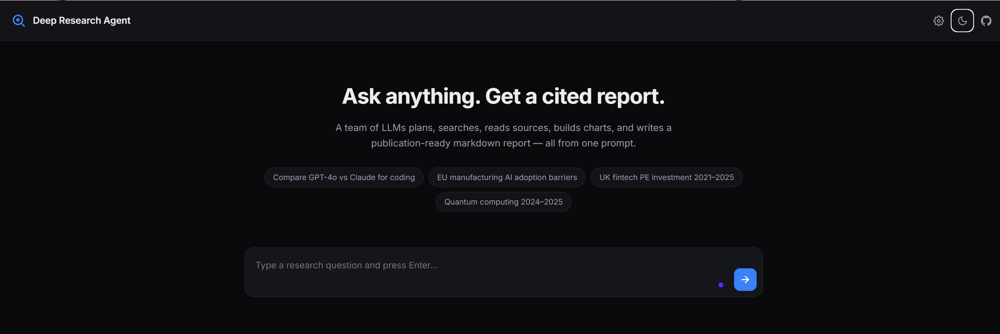
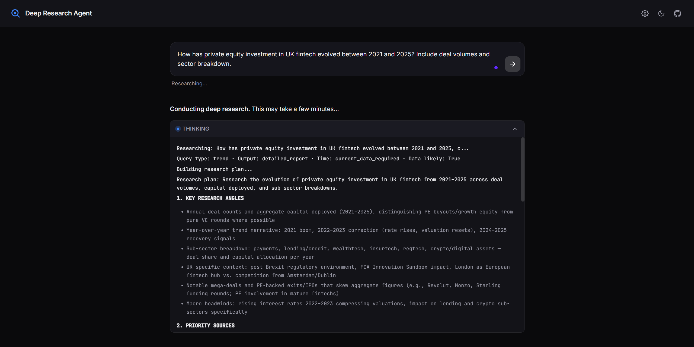
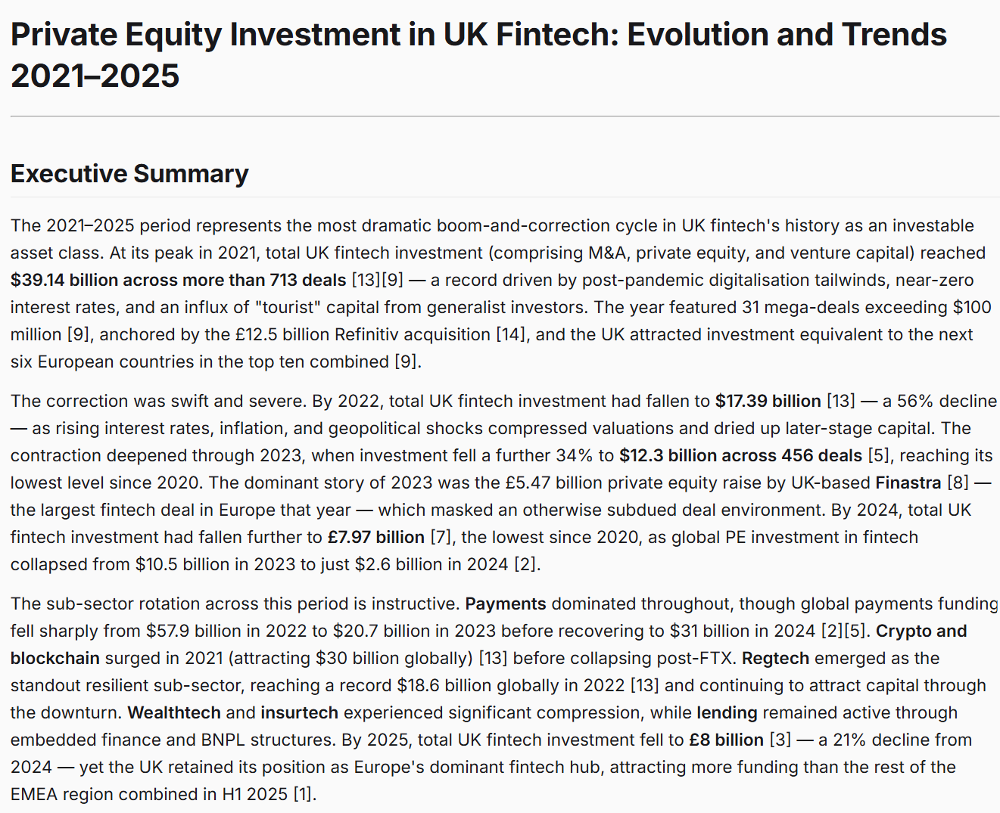

# Deep Research Agent

> A multi-agent ReAct system that conducts thorough web research and produces publication-ready, fully-cited reports — with auto-generated charts.

[](https://www.python.org/)
[](LICENSE)
[](https://fastapi.tiangolo.com/)

---

## What it does

You ask a research question. A team of specialized LLMs takes it from there:

1. **Understands the query** — figures out what kind of question it is, decides if clarification is needed, and breaks it into 3–6 specific sub-questions.
2. **Plans the research** — drafts an angle-by-angle plan, picks source priorities, sets a stopping condition.
3. **Runs a ReAct loop** — searches the web, reads full pages, extracts structured findings, generates charts from numeric data, tracks contradictions, and updates an in-memory research notebook between turns.
4. **Writes the report** — adapts structure to the query type (comparative, trend, analytical…), streams a markdown document with inline `[N]` citations and embedded charts (Mermaid / ECharts / Plotly).

Think *“hire a research analyst for 20 minutes”* rather than *“ask a chatbot.”*

---

## Demo



A four-phase ReAct loop runs Claude Sonnet through query understanding → planning → research → report writing. Every tool call streams live in a collapsible thinking section before the final cited report renders below.

| Streaming research | Final cited report |
|---|---|
|  |  |

---

## Highlights

- **Single reasoning owner.** One Claude-class model drives the entire ReAct loop end-to-end — no broken handoffs, no orphaned tool results.
- **The brain never sees raw HTML.** Page text is extracted into structured findings before the brain ever sees it. Costs less, hallucinates less.
- **Source quality is classified, not guessed.** Domains are mapped to evidence types (`official_regulatory`, `company_primary`, `market_news`, `analyst_forecast`, `academic`, `general_web`) by deterministic rules — official sources outrank blog spam by construction.
- **Budget-managed research.** Hard caps on ReAct steps (default 30), full-page reads (default 25), and chart generations (default 4). Stops cleanly when the budget runs out.
- **Deterministic verification layer.** Pure-Python checks run after every tool batch — orphan citations, fabricated source IDs, and SQs marked "answered" without an authoritative source all get flagged or auto-downgraded.
- **Chart tier selection.** A separate visualization specialist picks Mermaid (inline) for bar/line/pie/gantt/timeline, escalates to ECharts/Plotly only for radar/heatmap/scatter — with hard rules against mixing.
- **Streaming first.** Reports stream chunk-by-chunk via Server-Sent Events; chart placeholders are swapped for actual chart code mid-stream.
- **Provider-agnostic.** Any OpenAI-compatible chat-completions endpoint works — OpenAI, OpenRouter, Anthropic-via-proxy, Together.ai, Ollama, your own gateway. Set `OPENAI_BASE_URL` and go.

---

## How it works

```
┌──────────────────────────────────────────────────────────────┐
│                     Phase 0 — Understanding                   │
│  Single LLM call: parse intent, detect domain, decide         │
│  output format + time sensitivity, optionally ask user        │
│  for clarification before spending any research budget.       │
└──────────────────────┬───────────────────────────────────────┘
                       ▼
┌──────────────────────────────────────────────────────────────┐
│                     Phase 1 — Planning                        │
│  Single LLM call: structured plan covering angles, source     │
│  priorities, data needs, stopping condition.                  │
└──────────────────────┬───────────────────────────────────────┘
                       ▼
┌──────────────────────────────────────────────────────────────┐
│                     Phase 2 — ReAct Loop                      │
│                                                               │
│  ┌────────────┐  ┌────────────┐  ┌────────────────┐         │
│  │ search_web │  │  read_url  │  │  extract_data  │         │
│  └────────────┘  └────────────┘  └────────────────┘         │
│  ┌──────────────────┐  ┌──────────────────┐                 │
│  │  generate_chart  │  │  finish_research │                 │
│  └──────────────────┘  └──────────────────┘                 │
│                                                               │
│  After each tool batch: deterministic checks +                │
│  notebook update + brain-context-window injection.            │
└──────────────────────┬───────────────────────────────────────┘
                       ▼
┌──────────────────────────────────────────────────────────────┐
│                     Phase 3 — Report                          │
│  Outline builder picks structure for the query type, then     │
│  streaming writer emits markdown with `[N]` citations and     │
│  `{{CHART:id}}` placeholders. Stream wrapper swaps each       │
│  placeholder for the stored chart code (Mermaid/ECharts/      │
│  Plotly) inline as the report streams.                        │
└──────────────────────────────────────────────────────────────┘
```

Read the long-form architecture write-up: [`docs/architecture.md`](docs/architecture.md).

---

## Quick start

### Docker (one command)

```bash
git clone https://github.com/lashan3/Multi-Agent-Deep-Research-System.git
cd deep-research-agent
cp .env.example .env
# edit .env — set OPENAI_API_KEY and PERPLEXITY_API_KEY
docker compose up --build
```

Open <http://localhost:8000>.

### Manual install

```bash
git clone https://github.com/lashan3/Multi-Agent-Deep-Research-System.git
cd deep-research-agent

python -m venv .venv
source .venv/bin/activate   # on Windows: .venv\Scripts\activate
pip install -e .

cp .env.example .env
# edit .env — at minimum set OPENAI_API_KEY and PERPLEXITY_API_KEY

# Web UI:
deep-research serve
# CLI:
deep-research "Compare offshore wind in the North Sea vs Baltic"
```

---

## Configuration

All config is via environment variables (or a `.env` file).

| Variable | Required | Default | What it controls |
|---|---|---|---|
| `OPENAI_API_KEY` | yes | — | Key for the OpenAI-compatible LLM gateway. |
| `OPENAI_BASE_URL` | no | `https://api.openai.com/v1` | Any OpenAI-compatible endpoint. Set to `https://openrouter.ai/api/v1`, `https://router.requesty.ai/v1`, your own gateway, etc. |
| `PERPLEXITY_API_KEY` | yes | — | Powers `search_web` and `read_url`. Get one at [perplexity.ai/settings/api](https://www.perplexity.ai/settings/api). |
| `BRAIN_MODEL` | no | `anthropic/claude-sonnet-4-5` | Reasoning model — drives the ReAct loop, plan, outline, and report. Must support tool calling. |
| `FAST_MODEL` | no | `google/gemini-2.5-flash` | Cheap helper model — used for finding extraction and structured-data extraction. |
| `READER_MODEL` | no | `xai/grok-4-fast` | Model used by the Perplexity Agent endpoint to fetch full page text. |
| `MAX_REACT_STEPS` | no | `30` | Hard cap on brain turns inside the loop. |
| `MAX_READS` | no | `25` | Hard cap on full-page reads per session. |
| `MAX_CHARTS` | no | `4` | Hard cap on chart generations per session. |
| `MAX_SEARCH_RESULTS` | no | `10` | Results per search query (1–20). |
| `READER_ENABLED` | no | `true` | Set `false` to skip full-page reads (search-only mode). |
| `HOST` | no | `0.0.0.0` | Web server bind address. |
| `PORT` | no | `8000` | Web server port. |

> **Pick any provider you like.** The model IDs above are written in `provider/model` form, which works with OpenRouter, Requesty, and similar gateways. If you're hitting OpenAI directly, set `BRAIN_MODEL=gpt-4o` and `FAST_MODEL=gpt-4o-mini`.

---

## Usage

### Web UI

```bash
deep-research serve
# → open http://localhost:8000
```

The UI streams the entire research pipeline live: phase progression, search queries, source reads, chart generations, and the final report — with inline Mermaid rendering, code highlighting, and clickable citations.

### CLI

```bash
# Stream to terminal:
deep-research "What are the main barriers to AI adoption in EU manufacturing?"

# Save to a file:
deep-research "Compare Snowflake vs Databricks for mid-size finance" --save report.md

# Override budget caps:
deep-research "Quantum computing milestones 2024" --max-steps 15 --max-reads 10

# Override models (any OpenAI-compatible IDs):
deep-research "..." --brain-model gpt-4o --fast-model gpt-4o-mini
```

### Library

```python
from deep_research import DeepResearchAgent

agent = DeepResearchAgent()  # picks up env vars from .env

for chunk in agent.research("Compare LLM coding benchmarks for 2024–2025"):
    print(chunk, end="", flush=True)
```

Or with a custom config:

```python
from deep_research import DeepResearchAgent, Config

agent = DeepResearchAgent(
    Config(
        openai_api_key="...",
        openai_base_url="https://openrouter.ai/api/v1",
        perplexity_api_key="...",
        brain_model="anthropic/claude-sonnet-4-5",
        fast_model="google/gemini-2.5-flash",
        max_react_steps=20,
    )
)

report = "".join(agent.research("..."))
```

---

## Question types it handles well

| Type | Example |
|---|---|
| **Factual** | "What is the current EU AI Act compliance deadline?" |
| **Comparative** | "Compare Salesforce vs HubSpot for mid-market B2B" |
| **Analytical** | "Why are European AI startups losing talent to the US?" |
| **Trend** | "How has cloud spending evolved 2020–2025?" |
| **Open-ended** | "What are the key developments in quantum computing this year?" |

More examples and prompt-craft tips: [`examples/example_queries.md`](examples/example_queries.md).

---

## What's *not* in scope

This is a research agent, not a generic chatbot. It's deliberately narrow:

- **No multi-turn conversation memory.** Each query is a fresh research run. Conversational follow-ups are best handled by starting a new query that includes context.
- **No file uploads.** It researches the live web; if you need to research a private document, paste excerpts into the query.
- **No image generation.** Charts are code-generated (Mermaid/ECharts/Plotly), not raster images.
- **No human-in-the-loop tool approval.** The brain calls tools autonomously within the budget caps.

---

## Roadmap

- [ ] Pluggable search backend (DuckDuckGo / Brave Search alternatives to Perplexity)
- [ ] Persisted research sessions (resume / re-export prior reports)
- [ ] Optional retrieval over a local document corpus
- [ ] Configurable source-policy (custom domain → evidence-type mappings)
- [ ] Full-text export to DOCX / PDF

PRs welcome.

---

## License

MIT — see [LICENSE](LICENSE).

## Author

**Muhammad Lashan Ali Zahid**
GitHub: [@lashan3](https://github.com/lashan3)
